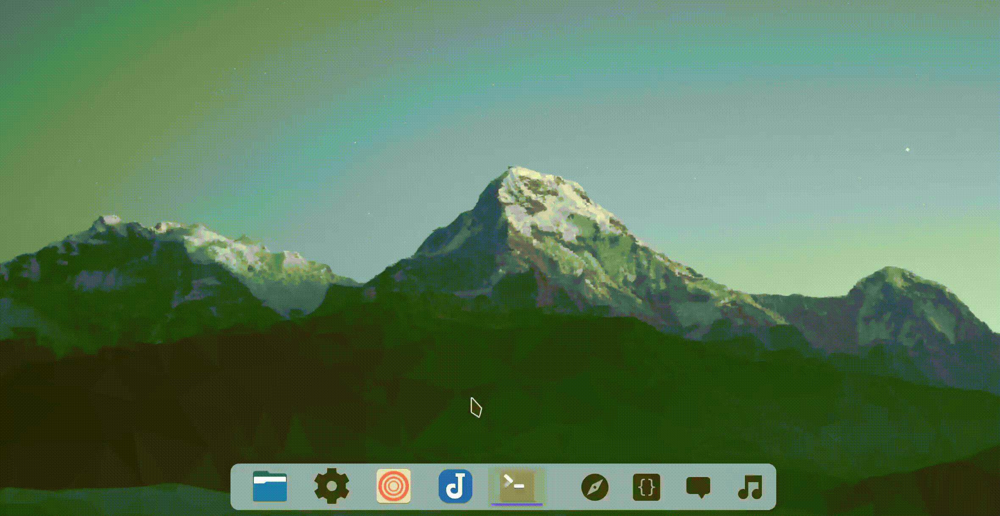
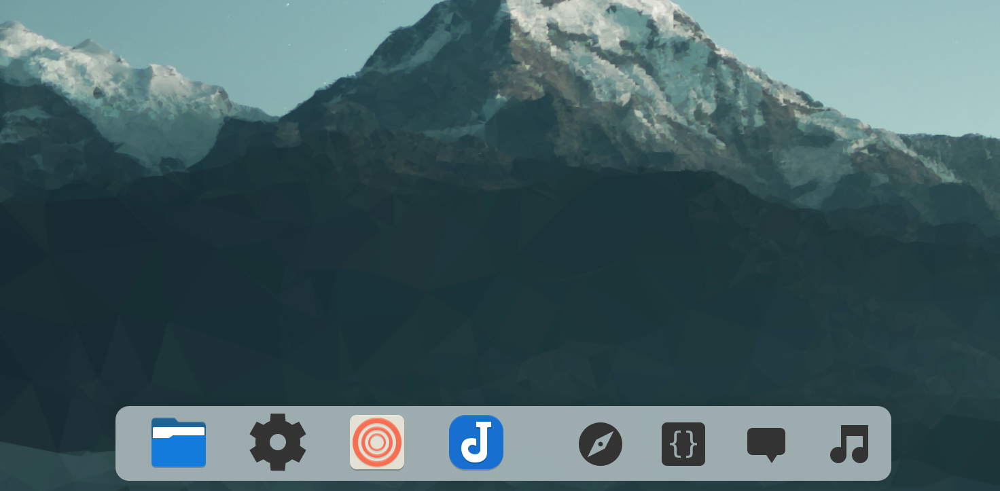
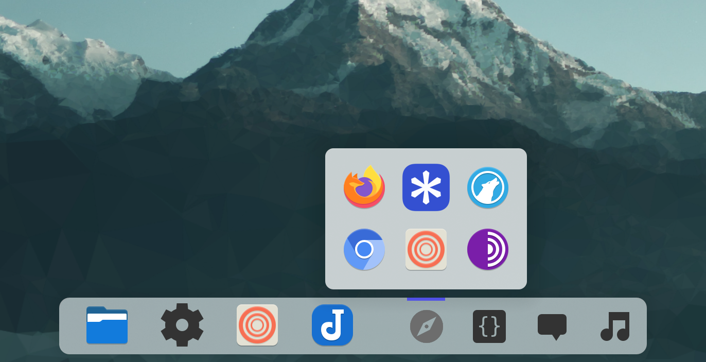
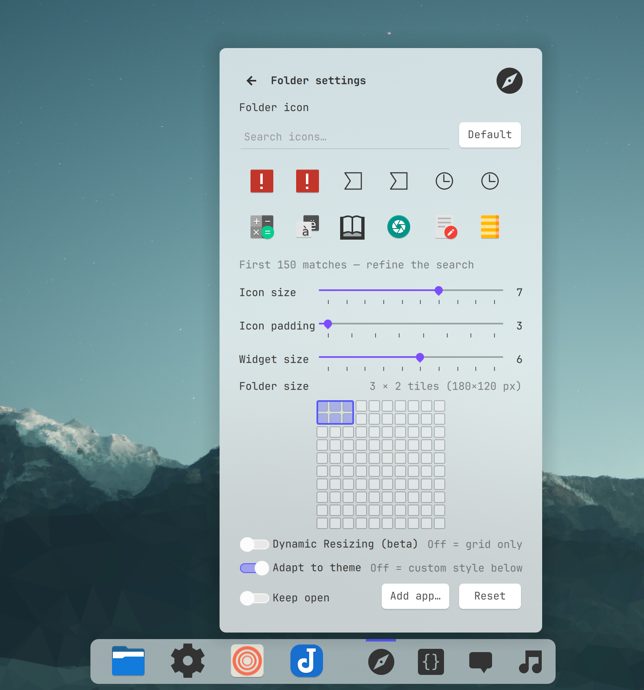

# App Folder — macOS-style app folders for the KDE Plasma panel



Group apps into spring-loaded folder popups. Click the folder icon and a
panel-styled popup opens right above it; click an app to launch, drag icons
to reorder, right-click for settings.





## Features

- **Native Plasma widget**: add it N times from *Add widgets*, one per
  folder, each with its own config — no daemons, no taskbar pins
- **Shell-owned popup**: anchoring, theme, blur, and outside-click behavior
  come from Plasma itself
- **Reorder by dragging** any icon onto another (release to drop, drag
  outside to cancel) — order persists per folder
- **Folder settings** (right-click → *Folder settings…*): pick the folder
  icon from installed icon themes, icon-size and widget-size sliders (1–10),
  add-app shortcut, reset — plus an *Adapt to theme*
  toggle with custom color/opacity/corners/outline when off
- **Folder size by grid picker**: in settings, hover a 10×10 grid and
  click to size the folder in whole tiles (e.g. 3×2) — the primary size
  control, kept per folder
- **Optional border-drag resizing (beta)**: a toggle in settings enables
  dragging the popup edges; the frame always stays a whole number of
  icon tiles (1–15 per axis) and snaps to the closest multiple on
  release. Off by default; with a picked size, stray drags spring back
- **Add apps** via file picker (reliable), or drag `.desktop` files in
  when the source needs no extra click; right-click an app to remove it
- **Placement that behaves like Plasma**: the popup centers on its
  panel icon; when the folder is wider than the remaining panel space
  it clamps inside the panel exactly like stock Plasma popups

## Requirements

- KDE Plasma **6.4 or newer** on Wayland (native popup-window menus need
  Qt 6.8, which Plasma 6.4 is the first to require; developed and tested
  on Fedora KDE, Plasma 6.7 / Qt 6.11)
- `kpackagetool6`, `kioclient` (both standard on Plasma)
- `python3`, `gdbus` (standard on most distros): the widget resolves
  themed icon names to files with a small Python helper and drives KWin
  scripting (folder placement, resize snapping) through `gdbus`. Without
  `python3`, tiles with themed icons render blank; without `gdbus`,
  resize/placement assistance silently degrades

## Install

```sh
git clone <your-repo-url> app-folder
cd app-folder
./install.sh
```

Then add folders to your panel:

1. Right-click the panel (or desktop) → *Add widgets…*
2. Search **App Folder** → **Add** (repeat for each folder you want)
3. Click the folder to open its popup, then right-click a tile (or the
   empty grid) → *Add app…* to fill it — the closed widget's right-click
   is Plasma's own applet menu

## Usage

| Action | How |
|---|---|
| Open / close folder | Click the folder widget |
| Launch app | Click its icon in the popup |
| Reorder icons | Drag an icon onto another, release |
| Resize frame | *Folder settings…* → hover the size grid, click to commit (snaps to whole icon tiles) |
| Optional border drags | *Folder settings…* → *Dynamic Resizing (beta)*, then drag popup edges |
| Remove app | Right-click it → *Remove from folder* |
| Add app (picker) | Right-click → *Add app…*, pick a `.desktop` file |
| Add app (drag) | Drag `.desktop` files in when the source needs no extra click (clicking elsewhere closes the popup); otherwise use the picker |
| Folder icon, sizes, style | Right-click → *Folder settings…* |
| Flip pages | Mouse wheel anywhere over the grid (a page holds as many tiles as the folder currently fits — bigger folders, fewer flips) |
| Keep a folder open | Right-click → *Keep open* (per popup, cleared when the folder closes) |

## Configuration

Each widget instance stores its own config (no files to edit):

- `folderApps`: JSON array of `{desktop, name, icon}`
- `folderIcon`: taskbar/panel icon name
- `iconScale`, `iconPad`, `compactScale`: 1–10 (icon tile size / padding
  / panel widget size; padding floor 3 — the frame keeps a fixed theme
  margin that lower values cannot reduce)
- `folderCols`, `folderRows`: the committed grid-pick size
- `dynamicResize` (default off): border-drag resizing
- `themeAdapt` (default on), `bgColor`, `bgOpacity`, `cornerScale`,
  `outlineScale`: custom decoration when adapt is off

The popup frame size is saved by the shell per instance and always
requantized to whole tiles on open.

## How it works

- `plasmoid/` is a pure-QML `PlasmoidItem`: compact icon + shell-managed
  `fullRepresentation` popup. No compiler needed, no background processes.
- App launching and file reads go through the `executable` data engine
  (`kioclient exec` for launches, `cat` for reads) — callbacks keyed by
  exact command, stdout read synchronously, disconnect deferred (both
  failure modes were found the hard way and are commented in the code).
- Icon picker inventory is a single `find(1)` scan over the icon theme
  directories (active theme + breeze + hicolor + `~/.local/share/icons`),
  cached per theme.

## Troubleshooting

- **Widget not listed after install**: run
  `kpackagetool6 -u plasmoid -t Plasma/Applet`, then restart plasmashell
  (`plasmashell --replace &`) or log out/in.
- **A drop does nothing**: clicking the source window dismisses the popup
  before the drop lands — use the *Add app…* picker instead (always works).
- **An added entry never made a tile**: entries are validated at add time
  (unreadable or bare `name.desktop` paths are skipped). A file deleted
  AFTER it was added keeps its tile but will not launch — check
  `kioclient exec <file>` in a terminal, then remove and re-add the tile.
- **Pinned taskbar apps can't be dragged out** (Plasma limitation): unpin
  first, then drag from Kickoff.
- **Launch does nothing**: check `kioclient exec <file>` works for that
  `.desktop` entry in a terminal.
- **Tiles are blank**: themed icon names are resolved by a `python3`
  helper — see Requirements.

## Legacy daemon build (v1)

`legacy/` keeps the original standalone Python daemon (layer-shell popup +
taskbar pins, no widget installation). Install it instead with
`./install.sh --legacy`, remove with `./uninstall.sh --legacy`. It is
feature-frozen; new work happens in the plasmoid.

## Uninstall

```sh
./uninstall.sh                 # removes the widget package
./uninstall.sh --legacy        # removes the daemon + launchers
./uninstall.sh --legacy --purge  # also removes ~/.config/app-folder
```

Remove any App Folder widgets from the panel/desktop manually.

## License

MIT — see [LICENSE](LICENSE).
